<div align="center">



# Local Coding Agent

Local MCP server giúp ChatGPT Web đọc/sửa code, chạy command và xem git trên máy bạn. Mục tiêu là biến ChatGPT thành coding agent làm việc trực tiếp trên workspace local, nhưng vẫn giữ quyền kiểm soát ở phía bạn.

</div>

> Công cụ này có thể chạy command trên máy bạn. Chỉ dùng với repo tin tưởng.
> Đây không phải OS sandbox. Đọc thêm [SECURITY.md](SECURITY.md).

## Cài Nhanh

Bạn chỉ cần làm 4 bước:

1. Chạy setup wizard trong repo `local-coding-agent`.
2. Cấu hình project bằng `lca reset` và `lca add`.
3. Chạy agent nền bằng `lca start --background`.
4. Thêm custom MCP connector trong ChatGPT Web.

Yêu cầu:

- Node.js >= 18
- npm
- Git, khuyên dùng để các lệnh project tự lấy Git root hiện tại
- OpenAI Tunnel ID và Runtime API key nếu dùng ChatGPT Web tunnel

Chạy setup wizard:

```bash
# macOS / Linux / WSL
bash scripts/lca setup
```

```powershell
# Windows
scripts\lca.cmd setup
```

Wizard sẽ tự detect hệ điều hành hiện tại, kiểm tra prerequisite, mở trang tạo Tunnel/API key, tạo/cập nhật `.env.local`, cài dependency trong `server/`, tải `tools/tunnel-client`, ghi config local và cài global command `lca`. Trên Windows, wizard sẽ thêm thư mục `lca.cmd` vào User PATH; mở terminal mới trước khi gõ `lca`.

Nếu cần xem hướng dẫn cho hệ điều hành khác máy đang chạy, dùng `node scripts/local-coding-agent.mjs setup --choose-os`.

## Dùng Hằng Ngày

LCA chạy như một service nền và có thể truy cập nhiều project cùng lúc:

```bash
lca reset /path/to/main-project  # xoá danh sách cũ, đặt project chính
lca add /path/to/second-project  # thêm project
lca add                          # thêm Git root của thư mục hiện tại
lca remove /path/to/project      # gỡ project
lca reset                        # chỉ giữ Git root của thư mục hiện tại
lca start --background           # chạy server + tunnel dưới nền
```

Khi agent đang chạy, `add`, `remove` và `reset` tự restart service để áp dụng danh sách mới.

Lệnh chính:

```bash
lca start --background
lca add [path]
lca remove [path]
lca reset [path]
lca stop      # dừng server + tunnel
lca status    # xem trạng thái
lca config    # mở TUI cấu hình mode/policy/port
lca doctor    # kiểm tra cấu hình local
```

Kiểm tra local:

```text
lca status
http://127.0.0.1:8789/healthz
```

## Tích Hợp ChatGPT Web

Chi tiết: [docs/CHATGPT_WEB_CONNECTOR.md](docs/CHATGPT_WEB_CONNECTOR.md).

Tóm tắt:

1. Chạy `lca setup`.
2. Cấu hình project bằng `lca reset` và `lca add`.
3. Chạy `lca start --background`.
4. Mở ChatGPT Web.
5. Settings -> Connectors -> Developer mode -> Add custom MCP connector.
6. Chọn tunnel đã tạo.
7. Auth: chọn `No auth`.
8. Lưu connector.
9. Trong ChatGPT, gọi tool `lca` hoặc `workspace_info` để kiểm tra các root thật.

Runtime API key nằm ở `.env.local` và chỉ dùng cho local tunnel-client. Không nhập Runtime API key vào phần auth của ChatGPT connector.

## ChatGPT Tools

Sau khi connector hoạt động, bạn thường chỉ cần gọi 2 tool này trong ChatGPT:

```text
lca        # alias ngắn của workspace_info, kiểm tra workspace thật
lca_input  # mở Apps SDK widget, có thể ghim PiP để nhập task trong lúc chat
```

`workspace_info` vẫn tồn tại cho tên rõ nghĩa hơn. `lca` là alias ngắn, tiện dùng khi mở chat mới hoặc muốn kiểm tra nhanh connector đang trỏ vào workspace nào.

## LCA Input: `@` Context và `/` Workflow

`lca_input` mở widget ngay trong ChatGPT để nhập task có context rõ hơn. Widget này dùng:

- `@...` để chọn file, folder, symbol hoặc skill trên toàn bộ project đã đăng ký bằng `lca add`.
- `/...` để gọi workflow hoặc skill, ví dụ `/debug`, `/review`, `/implement`, `/refactor`, `/skill:<name>`.
- Nút **PiP** yêu cầu ChatGPT ghim composer thành cửa sổ nổi để vẫn dùng được trong lúc tiếp tục chat.
- Nút nhanh **Plan** là quick action; không chèn chữ vào input.
- Nút send sẽ tự compose prompt rồi gửi vào ChatGPT, không cần hiện Prompt output.

Ví dụ task trong widget:

```text
/refactor @README.md làm README ngắn gọn hơn, giữ nguyên ý chính
```

ChatGPT luôn mở app ở inline trước, nên cần bấm **PiP** một lần để chuyển mode. Host sẽ quyết định mode cuối cùng; trên mobile, yêu cầu PiP có thể được chuyển thành fullscreen.

Các tool nền phía sau:

- `workspace_search`: autocomplete cho `@...` trên tất cả project đã add; kết quả hiển thị dạng `project-name/path/to/file` để phân biệt file trùng tên.
- `slash_commands`: autocomplete cho `/...`.
- `compose_prompt`: parse input, resolve context đã chọn, và tạo prompt sẵn để gửi vào ChatGPT.

## Figma Desktop MCP

LCA kết nối trực tiếp với **Figma Desktop MCP chính thức**, không gọi REST API và không cần tạo OAuth App, Client ID, Client Secret hay Personal Access Token. Figma Desktop dùng chính phiên đăng nhập hiện tại của bạn.

Endpoint mặc định:

```text
http://127.0.0.1:3845/mcp
```

### Bật trong Figma Desktop

1. Mở Figma Desktop và đăng nhập.
2. Mở một Figma Design file.
3. Chuyển sang Dev Mode bằng `Shift+D`.
4. Trong phần **MCP server**, chọn **Enable desktop MCP server**.

Sau đó chạy:

```bash
lca figma
```

`lca figma` sẽ kiểm tra kết nối, mở Figma Desktop nếu server chưa chạy, chờ bạn bật MCP rồi thử lại. Các lệnh khác:

```bash
lca figma status   # trạng thái JSON
lca figma tools    # tool và schema thật Figma đang cung cấp
lca figma open     # mở Figma và in hướng dẫn bật MCP
```

`lca setup` cũng có bước **Connect Figma Desktop MCP** sau khi cài dependency. Bước này không bắt buộc; có thể hoàn tất sau bằng `lca figma`.

Các tool chính trong ChatGPT:

```text
figma_get_design_context   # code/design context theo URL, node id hoặc selection hiện tại
figma_get_screenshot       # lấy ảnh selection/node và giữ nguyên image content
figma_get_metadata         # cây layer gọn để khoanh vùng frame lớn
figma_get_variable_defs    # variables và styles đang dùng
figma_list_tools           # đọc tool/schema live từ Figma Desktop
figma_call_tool            # gọi tool mới của Figma mà không phải cập nhật LCA trước
```

Ví dụ:

```text
@Macmini dùng figma_get_design_context và figma_get_screenshot đọc URL Figma này, rồi code màn hình Flutter theo source hiện tại.
```

Selection-based cũng hoạt động: chọn frame trong Figma Desktop rồi yêu cầu ChatGPT đọc selection mà không cần truyền URL.

## Config

Secret runtime nằm ở:

```text
.env.local
```

File này thường có:

```env
CONTROL_PLANE_TUNNEL_ID=tunnel_...
CONTROL_PLANE_API_KEY=sk-proj-...
```

Config CLI nằm trong thư mục app config của hệ điều hành. Xem path:

```bash
lca config path
```

## Project Roots Là Gì

Project roots là danh sách thư mục ChatGPT được phép đọc/sửa/chạy command thông qua connector. Project đầu tiên là root chính; các project thêm bằng `lca add` được truyền an toàn qua `AGENT_EXTRA_ROOTS_JSON`.

## Bảo Mật

Nguyên tắc an toàn:

- Không commit `.env.local`.
- Không in API key, Tunnel ID, token hoặc local config có secret.
- Chỉ mở workspace bạn tin tưởng.
- Luôn gọi `lca` hoặc `workspace_info` trong ChatGPT để kiểm tra root trước khi yêu cầu sửa file.

### Mode Và Policy

`Mode` là lớp an toàn cho command:

- `safe`: mặc định khuyên dùng. Chặn nhiều command nguy hiểm như xoá hệ thống, thao tác destructive, hoặc shell pattern rủi ro.
- `full`: ít chặn hơn ở tầng command. Chỉ dùng khi bạn tin workspace và chấp nhận rủi ro cao hơn.

`Policy` là lớp quyền cho tool/action:

- `balanced`: mặc định khuyên dùng. Cho workflow coding bình thường, nhưng action rủi ro cần approval token.
- `strict`: chặt hơn, phù hợp khi chỉ muốn agent đọc/review/inspect.
- `full`: bỏ policy approval gate, ít bị hỏi duyệt hơn nhưng rủi ro hơn.

Setup wizard mặc định chọn:

```text
Mode: full
Policy: full
```

Nếu muốn chặt hơn, có thể đổi lại `safe` hoặc `balanced` sau setup bằng TUI:

```bash
lca config
```

Chọn `Mode` hoặc `Policy`, lưu lại, và nếu agent đang chạy thì `lca config` sẽ tự restart để áp dụng cấu hình mới.

## Troubleshooting

| Lỗi                                                  | Cách xử lý                                                                                                                                                           |
| ---------------------------------------------------- | -------------------------------------------------------------------------------------------------------------------------------------------------------------------- |
| `lca: command not found` / `'lca' is not recognized` | Trên Windows: đóng terminal cũ, mở terminal mới rồi chạy lại `lca`. Nếu vẫn lỗi, chạy `scripts\lca.cmd cli` để cài lại wrapper hoặc gọi trực tiếp path wizard in ra. |
| Server chạy nhầm repo                                | `cd` vào repo đúng rồi chạy lại `lca`.                                                                                                                               |
| Port `8789` bận                                      | Chạy `lca setup` và đổi MCP port, hoặc set `PORT` trước khi chạy.                                                                                                    |
| Server không health                                  | Kiểm tra `lca status` và `http://127.0.0.1:8789/healthz`.                                                                                                            |
| Connector không thấy tool                            | Đảm bảo `lca` đang chạy, tunnel connected, connector dùng `No auth`.                                                                                                 |
| Sửa nhầm repo                                        | Trong ChatGPT gọi `lca` hoặc `workspace_info` để xem root thật.                                                                                                      |

## Low-Level CLI

CLI gốc vẫn còn cho debug:

```bash
node scripts/local-coding-agent.mjs status
node scripts/local-coding-agent.mjs doctor
node scripts/local-coding-agent.mjs logs
```

Flow bình thường nên dùng global command:

```bash
lca
```

## License

[AGPL-3.0-or-later](LICENSE) © 2026 Lương Duy
([@luongduy2798](https://github.com/luongduy2798)).
