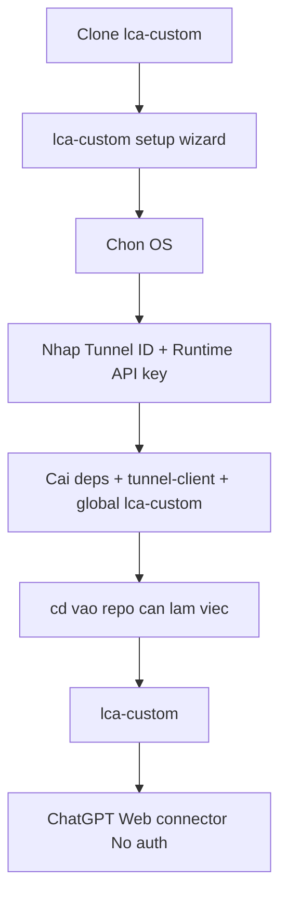

# AI Agent Setup Prompt

Copy prompt này vào Claude Code, Cursor hoặc agent local khác nếu muốn nó hỗ trợ cài repo này.

```text
Hãy cài Local Coding Agent theo flow TUI mới.

Repository:
https://github.com/matxatamtay/lca-custom

Mục tiêu:
- Clone repo nếu chưa có.
- Kiểm tra Node.js >= 20, npm, Git và Docker.
- Chạy setup wizard chính.
- Cài global command lca-custom.
- Kiểm tra tôi có thể cd vào repo bất kỳ và chạy lca-custom.

Quy tắc:
- Không commit secret, API key, Tunnel ID, .env.local, tools/ hoặc generated profiles.
- Không in giá trị secret ra màn hình.
- Không chạy lệnh destructive.
- Runtime hiện tại là trusted-local/direct-only; không cấu hình Codex, Hermes hoặc secondary coding-agent provider.

Các bước:
1. Kiểm tra Node.js >= 20, npm, Git và Docker.
2. Clone repo nếu cần.
3. cd vào lca-custom.
4. Chạy setup wizard:
   - macOS/Linux/WSL: bash scripts/lca-custom setup
   - Windows: scripts\lca-custom.cmd setup
5. Khi wizard hỏi, để tôi nhập Tunnel ID và Runtime API key.
6. Kiểm tra command lca-custom wrapper chạy được. Trên Windows, yêu cầu mở terminal mới trước khi dùng lệnh `lca-custom` vì User PATH mới không áp dụng cho terminal đang mở.
7. Hướng dẫn dùng:
   lca-custom reset /path/to/repo
   lca-custom start --background
   lca-custom status
   lca-custom doctor
   lca-custom tui
8. Nếu chỉ cần local MCP, dùng `lca-custom start --background --no-tunnel`.
9. Báo lại health URL, MCP URL, workspace hiện tại, kết quả `lca-custom status` và cách stop bằng `lca-custom stop`.
```

## Setup Map



Chi tiết connector: [CHATGPT_WEB_CONNECTOR.md](CHATGPT_WEB_CONNECTOR.md).
