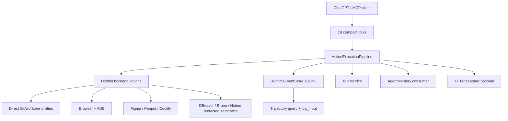

<!-- GENERATED by server/scripts/generate-architecture-catalogs.mjs. DO NOT EDIT BY HAND. -->
# Runtime graph

### Invariants

- LCA executes coding work directly; there is no secondary model-runner layer.
- LCA is trusted-local: capability is allowed by default; validation protects correctness, not permission ceremony.
- DBeaver, Bruno, and Notion preserve their integration-specific protection semantics.
- Project roots are discovery/default-routing inputs, not authorization boundaries.
- Runtime JSONL is authoritative for trajectory/recovery; OTLP is an optional external projection.
